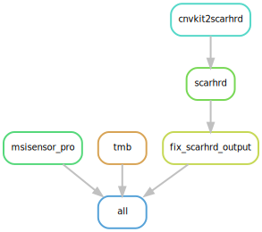

#  hydra-genetics/biomarker

Snakemake module containing processing steps used to generate different kind of biomarkers


[](https://opensource.org/licenses/gpl-3.0.html)

## :speech_balloon: Introduction

The module consists of rules used to generate biomarkers. Currenlty available biomarkers are:
* --HLA-typing-- (still under development)
* HRD (homologous recombination deficiency) (experimental, does not work using conda)
* TMB (tumor mutational burden)
* Msi (microsatellite instability)


## :heavy_exclamation_mark: Dependencies

In order to use this module, the following dependencies are required:

[](https://github.com/hydra-genetics/)
[](https://pandas.pydata.org/)
[](https://www.python.org/)
[](https://snakemake.readthedocs.io/en/stable/)
[](https://sylabs.io/docs/)
[](https://pypi.org/project/drmaa/)
[](https://pypi.org/project/tabulate/)

## :school_satchel: Preparations

### Sample and unit data

Input data should be added to [`samples.tsv`](https://github.com/hydra-genetics/prealignment/blob/develop/config/samples.tsv)
and [`units.tsv`](https://github.com/hydra-genetics/prealignment/blob/develop/config/units.tsv).
The following information need to be added to these files:

| Column Id | Description |
| --- | --- |
| **`samples.tsv`** |
| sample | unique sample/patient id, one per row |
| tumor_content | ratio of tumor cells to total cells |
| **`units.tsv`** |
| sample | same sample/patient id as in `samples.tsv` |
| type | data type identifier (one letter), can be one of **T**umor, **N**ormal, **R**NA |
| platform | type of sequencing platform, e.g. `NovaSeq` |
| machine | specific machine id, e.g. NovaSeq instruments have `@Axxxxx` |
| flowcell | identifer of flowcell used |
| lane | flowcell lane number |
| barcode | sequence library barcode/index, connect forward and reverse indices by `+`, e.g. `ATGC+ATGC` |
| fastq1/2 | absolute path to forward and reverse reads |
| adapter | adapter sequences to be trimmed, separated by comma |

### Reference data

## Msi

A panel of normal created by running MsiSensor-pro on a number of normal samples. Can be created with the help of the [hydragenetics/references](https://github.com/hydra-genetics/references) module.

## TMB

A panel specific artifact list and position specific background noise levels. Can be created with the help of the [hydragenetics/references](https://github.com/hydra-genetics/references) module.

## :white_check_mark: Testing

The workflow repository contains a small test dataset `.tests/integration` which can be run like so:

```bash
$ cd .tests/integration
$ snakemake -s ../../Snakefile -j1 --configfile config.yaml --use-singularity
```

## :rocket: Usage

To use this module in your workflow, follow the description in the
[snakemake docs](https://snakemake.readthedocs.io/en/stable/snakefiles/modularization.html#modules).
Add the module to your `Snakefile` like so:

```bash
module biomarker:
    snakefile:
        github(
            "hydra-genetics/biomarker",
            path="workflow/Snakefile",
            tag="v0.1.0",
        )
    config:
        config


use rule * from biomarker as biomarker_*
```

### Compatibility

Latest:
 - alignment:v0.2.0
 - annotation:v0.1.0
 - cnv_sv:v0.1.0
 - prealignment:v0.4.0

See [COMPATIBLITY.md](../master/COMPATIBLITY.md) file for a complete list of module compatibility.

### Input files

| File | Description |
|---|---|
| ***`hydra-genetics/alignment data`*** |
| `alignment/samtools_merge_bam/{sample}_{type}.bam` | aligned reads |
| `alignment/samtools_merge_bam/{sample}_{type}.bam.bai` | index file for alignment |
| ***`hydra-genetics/annotation`*** |
| `annotation/background_annotation/{sample}_{type}.background_annotation.vcf.gz` | annotated vcf |
| ***`hydra-genetics/cnv_sv data`*** |
| `cnv_sv/cnvkit_call/{sample}_{type}.loh.cns` |  cnvkit segmentation results |
| ***`hydra-genetics/prealignment`*** |
| `prealignment/merged/{sample}_{type}_fastq1.fastq.gz` | merged and trimmed reads |
| `prealignment/merged/{sample}_{type}_fastq2.fastq.gz` | merged and trimmed reads |

### Output files

The following output files should be targeted via another rule:

| File | Description |
|---|---|
| `biomarker/hrd/{sample}_{type}.hrd_score.txt` | calculated HRD score (old method) |
| `biomarker/scarhrd/{sample}_{type}.scarhrd_cnvkit_score.txt` | calculated HRD score based on cnvkit and scarHRD (experimental) |
| `biomarker/msisensor_pro/{sample}_{type}` | msi score |
| `biomarker/tmb/{sample}_{type}.TMB.txt` | tmb score and variants used |


## :judge: Rule Graph

### Biomarker


