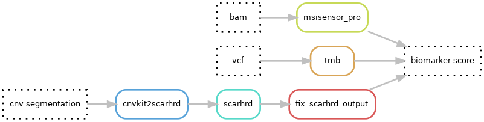

# Hydra-genetics biomarker module
The biomarker module consists of programs used for producing biomarker values. The biomarkers currently implemented are:

 - TMB: tumor mutational burden
 - MSI: micro satellite instability score
 - **Under development**:  homologous recombination deficiency score
 - Fragmentomics: 
     - End-motifs
     - Interval-end-motifs
     - mds (motif diversity score)
     - interval mds
     - fragment length bins
     - fragment length patient score

## Dag graph

## Module input files
Depending on the biomarker the input files are either bam-files, vcf-files, or cnv segmentation files.

* `annotation/background_annotation/{sample}_{type}.background_annotation.vcf.gz`
* `alignment/samtools_merge_bam/{sample}_{type}.bam`
* `cnv_sv/cnvkit_call/{sample}_{type}.{tc_method}.loh.cns`

## Module output files
The biomarker scores are reported in simple text format files.

* `biomarker/tmb/{sample}_{type}.TMB.txt`
* `biomarker/msisensor_pro/{sample}_{type}`
* `biomarker/scarhrd/{sample}_{type}.{tc_method}.scarhrd_cnvkit_score.txt`
* `biomarker/finaletoolkit_end_motifs/{sample}_{type}.end-motifs.tsv`
* `biomarker/finaletoolkit_interval_end_motifs/{sample}_{type}.interval-end-motifs.tsv`
* `biomarker/finaletoolkit_mds/{sample}_{type}.mds.txt`
* `biomarker/finaletoolkit_interval_mds/{sample}_{type}.interval-mds.txt`
* `biomarker/finaletoolkit_frag_length_bins/{sample}_{type}.frag-length-bins.tsv`
* `biomarker/fragmentomics_fragment_length_patient_score/{sample}_{type}.fragment_length_patient_score.txt`