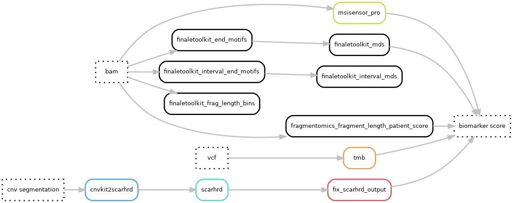

# Hydra-genetics biomarker module
The biomarker module consists of programs used for producing biomarker values. The biomarkers currently implemented are:

 - TMB: tumor mutational burden
 - MSI: micro satellite instability score
  - **Under development**:  homologous recombination deficiency score

## Dag graph

## Module input files
Depending on the biomarker the input files are either bam-files, vcf-files, or cnv segmentation files.

* `annotation/background_annotation/{sample}_{type}.background_annotation.vcf.gz`
* `alignment/samtools_merge_bam/{sample}_{type}.bam`
* `cnv_sv/cnvkit_call/{sample}_{type}.{tc_method}.loh.cns`

## Module output files
The biomarker scores are reported in simple text format files.

* `biomarker/tmb/{sample}_{type}.TMB.txt`
* `biomarker/msisensor_pro/{sample}_{type}`
* `biomarker/scarhrd/{sample}_{type}.{tc_method}.scarhrd_cnvkit_score.txt`